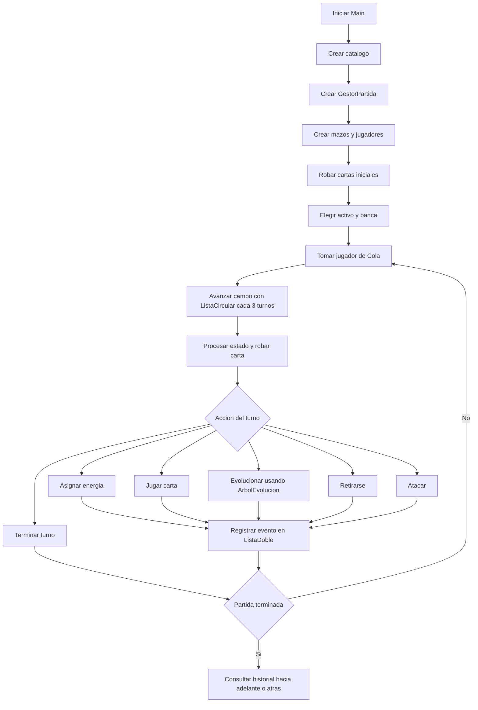
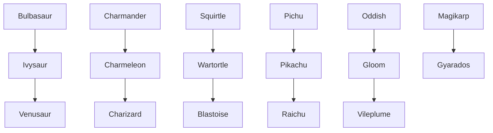

# Diagramas del juego

Estos diagramas documentan el flujo que ejecuta el programa actualmente.

## Flujo de una partida

## Arbol de evolucion

## Estructuras utilizadas

- `Cola`: organiza el orden de los turnos.
- `ColaPrioridad`: procesa habilidades prioritarias.
- `Pila`: representa mazo y descarte.
- `ListaSimple`: almacena la mano.
- `ListaCircular`: rota el campo de batalla.
- `ListaDoble`: conserva el historial de eventos y cartas jugadas.
- `ArbolEvolucion`: resuelve la siguiente evolucion de cada familia.
